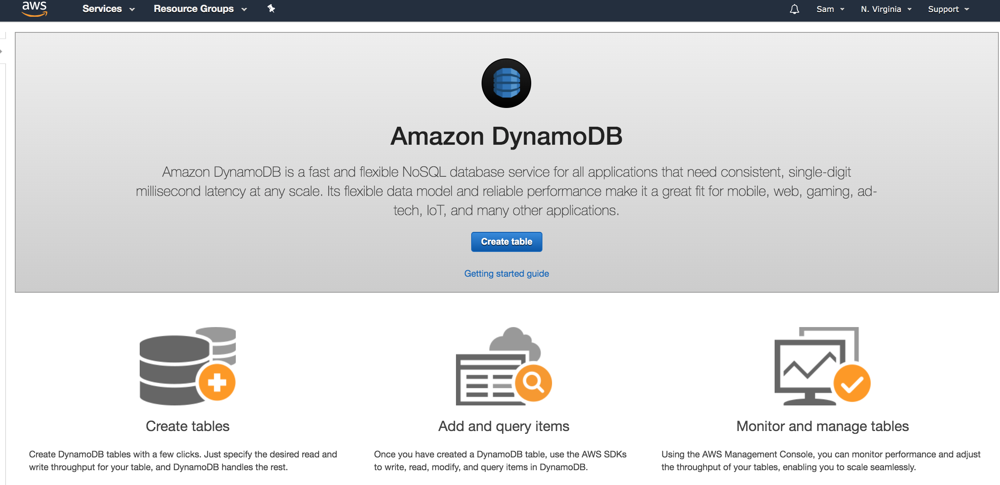
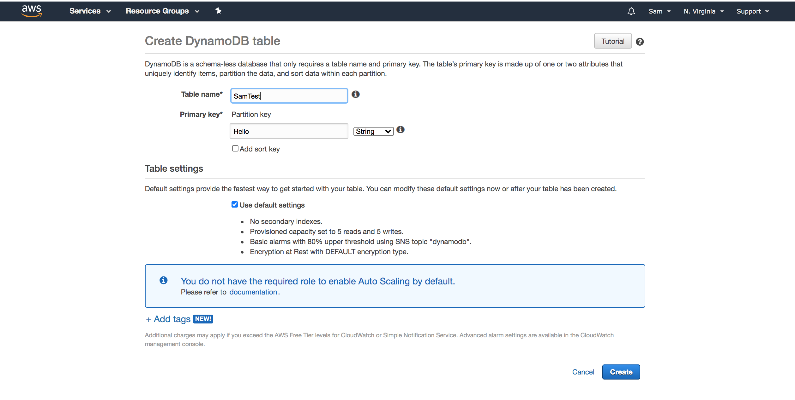
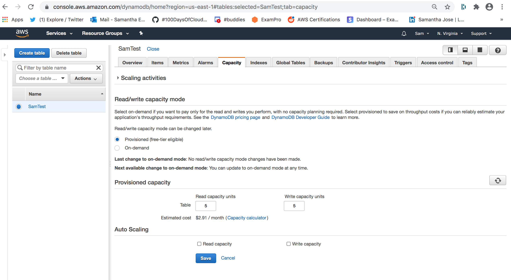
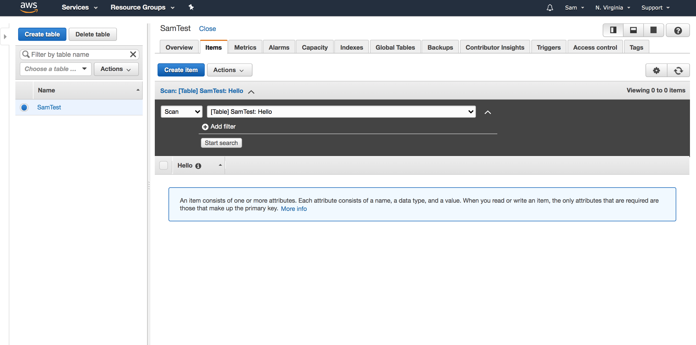
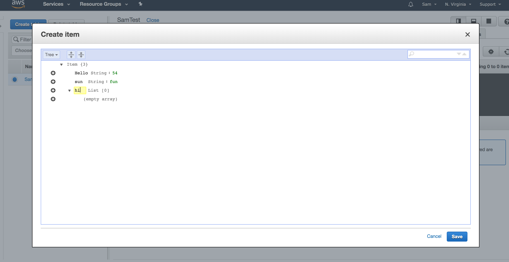
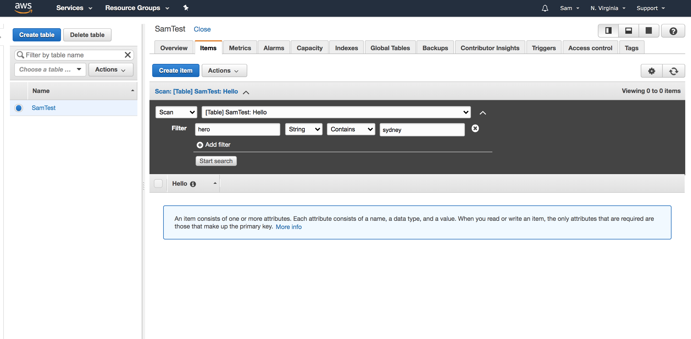
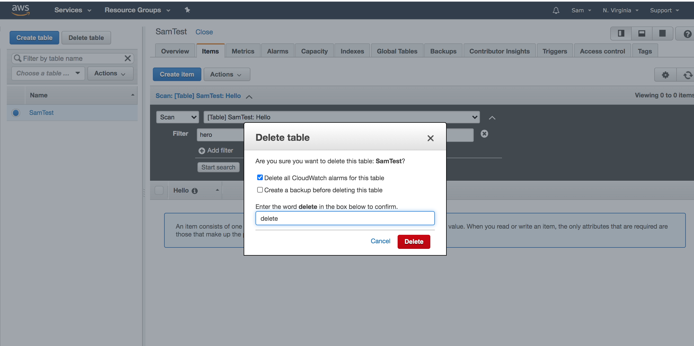

# Create a DynamoDB

## Create DynamoDB Table with Provisioned Capacity

**Click Create Table**

**Name Table and Partition Key then Select Create**

**Click on Capacity Tab, Select Provisioned (free tier eligible) and Click Save**

## Create 3 Random Items in the table

**Click on Items Tab and Create item**

**Enter in your Item Info and Click Save, Do this 2 more times**

## Run a scan on the table that returns all 3 items

**(Not really sure what I’m doing so I’m going to watch some videos on youtube)**

**I scanned table but I’m lost on how to return all 3 items... So I’m going to skip this and be done for today** 🤷‍♀️ 

 

## How to Delete Table 

**I’m going to delete my table**

**Click Delete**

## Does DynamoDB support Encryption?

**Yes DynamoDB supports encryption**

## What are Global Tables?

**Global tables is a replica of one or more replica tables all from one AWS account.**

